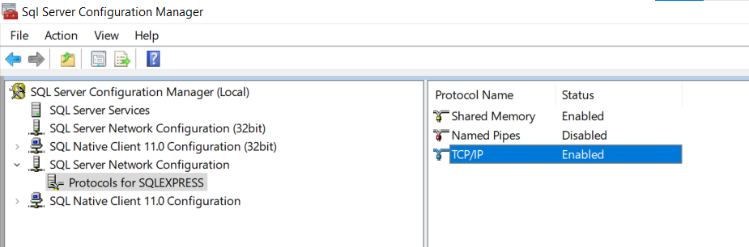

# CI-CD

## Environment setup

### Install jenkins using docker follow the link:  

https://dev.to/andresfmoya/install-jenkins-using-docker-compose-4cab  

### Install python and pip to your jenkins container.  

Open docker container in terminal:  

type 
```
# apt update
# apt install python3
# apt install python3-pip
# python3
# quit()
```

### Define pipeline in SCM:
https://www.jenkins.io/doc/book/pipeline/getting-started/#defining-a-pipeline-in-scm  

- click new item  

  

- add name:  

  

- in configuration of the pipeline choose Pipeline script from SCM:
  

- provide link to git repository, branch to use and name of jenkins file  


- in order to be able to push to the remote repository you will need credentials  
1. create token in the repository in github  

settings   


generate new token  


select scope  


## Packages you need:
- pymssql 2.2.5
- pytest 7.2.0
- pytest-html-reporter 0.2.9  
- 
They are listed in the requirements.txt file

## Useful hints 
### SQL Server
- to create a new user with password make sure to configure SQL Server Database Engine to start using SQL Server and Windows Authentication mode
https://learn.microsoft.com/en-us/sql/database-engine/configure-windows/change-server-authentication-mode?view=sql-server-ver15
- to connect to SQL Server database make sure connection through TCP/IP is enabled

- to provide the correct port run the following query in  SQL Server Management Studio :  
```
DECLARE @portNumber NVARCHAR(10);

EXEC xp_instance_regread

     @rootkey = 'HKEY_LOCAL_MACHINE',

     @key = 'Software\Microsoft\Microsoft SQL Server\MSSQLServer\SuperSocketNetLib\Tcp\IpAll',

     @value_name = 'TcpDynamicPorts',

     @value = @portNumber OUTPUT;

SELECT [Port Number] = @portNumber;

GO
```
To provide server to your local host type ipconfig in cmd:  

```
ipconfig
```
### Jenkins pipeline
to debug pipeline run there is no need to edit jenkins file in the repository  

You can go to builds, click on the last buils and choose replay to edit   

  

And rerun the same build with changes in jenkins file  


## Report
### Pytest
to create the report, run 
```$ pytest . --html-report=./report```
in terminal

use git bash
### Jenkins
jenkins plugin can be used to collect test results in the report  


## Execution

to run test print in terminal :
```
python -m pytest .
```
